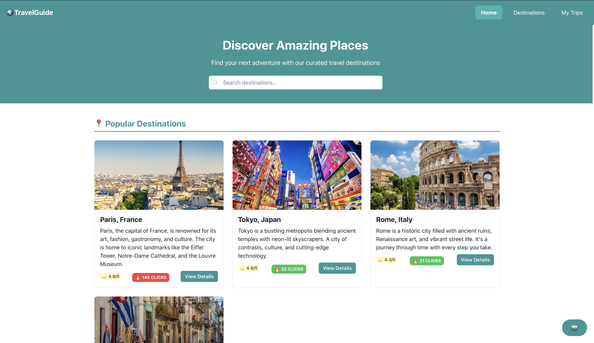
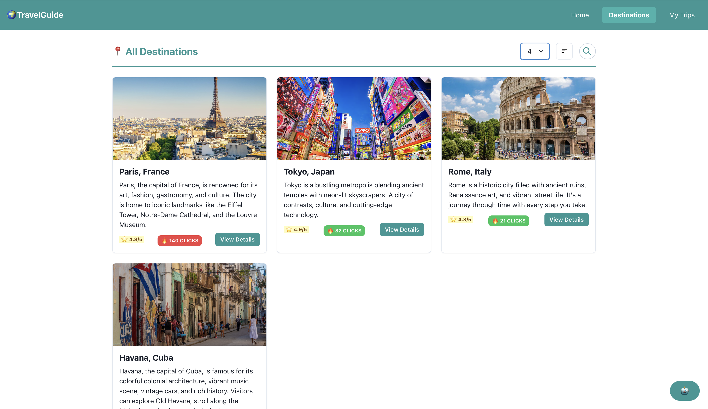
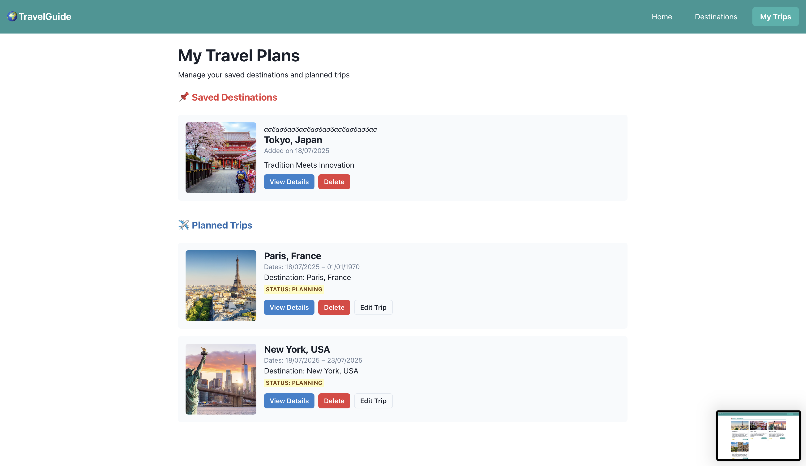

## 🌍 Tourism Guide App 

### 📋 Overview

This is a responsive tourism guide application built with React and Chakra UI. The app allows users to:

Explore top travel destinations
View detailed travel guides
Save and manage upcoming trips

### 🛠 Tech Stack
React (Create React App)
Chakra UI for UI components
React Router for page navigation
React Hooks (useState, useEffect)
Custom Hook: useTrips for trip state management

### ✅ Features
3 main pages: Home, Destination Details, My Trips
Mock data via data/destinations.js
Search functionality on home page
Responsive design for desktop and mobile
Trip management: Add, view, edit, remove trips
Modal components for trip editing/adding
Clean UI with Chakra UI styling

### 📂 Project Structure
src/
├── App.js                   # Routing & layout
├── index.js                # App entry
├── components/             # Add/Edit Trip Modal
│   ├── AddTripModal.js
│   └── EditTripModal.js
├── data/
│   └── destinations.js     # Mock destination data
├── hooks/
│   └── useTrips.js         # Custom state management hook
├── pages/
│   ├── Home.js
│   ├── DestinationsPage.js
│   ├── DestinationDetails.js
│   └── MyTrips.js
...

### 🚀 Getting Started
Install dependencies
npm install
Start the development server
npm start
Build for production
npm run build

### 🔍 Features Overview
### 🏠 Home Page
Destination search bar
Destination grid preview
"View Details" button navigates to detail page

### 🗺 Destination Details
Shows info, attractions, food, trip data
Buttons: "Add to My Trips", "Book Now"

### 📌 My Trips Page
Saved destinations list
Planned trips with edit options via modals

### 📸 Screenshots

### ✅ Success Criteria (from assignment)
 Routing across all pages
 Functional components and React Hooks
 Chakra UI used consistently
 Responsive across mobile/desktop
 Search & interactive UI elements

### 🧪 Testing
Basic manual testing for all user flows
Error handling for empty fields, navigation
